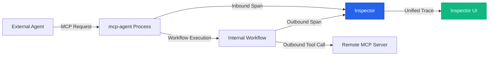
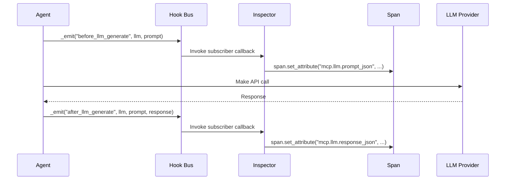

# Inspector Architecture

**Version**: 1.0
**Status**: Current
**Primary Audience**: Developers, System Architects, AI Assistants

This document provides the authoritative architectural overview for `mcp-agent-inspector`. It is intended to be machine-readable for AI assistants and a comprehensive guide for human developers.

## 1. Core Principles

The Inspector is built on two foundational principles:

1.  **Zero External Dependencies**: A developer can get a fully-featured, live, and historical trace debugger by adding one line of code (`inspector.mount(app)`) without needing to install, configure, or manage any external databases, message queues, or services. See [Zero-Dependency Design](#3-zero-dependency-design) for details.
2.  **Grounded in `mcp-agent` Reality**: The Inspector is not a generic tool; it is purpose-built to provide insight into the specific patterns and complexities of `mcp-agent`, including its dual client/server role and its composable workflow architecture.

## 2. System Components

The Inspector consists of a backend embedded within the user's process and a pre-built React frontend.

```yaml
backend:
  # Embedded in the user's mcp-agent process.
  - component: inspector.gateway
    description: A Starlette/FastAPI router mounted at /_inspector. Handles all API requests.
  - component: inspector.exporters.FileSpanExporter
    description: An OpenTelemetry SpanExporter that writes traces to gzipped JSONL files.
  - component: inspector.listeners.InspectorEventListener
    description: Listens to the mcp-agent AsyncEventBus and streams events to the frontend via SSE.
  - component: inspector.decorators
    description: Decorators like @dump_state_to_span that enrich traces with application-specific state.

frontend:
  # A pre-built React Single-Page Application (SPA).
  # UI/UX patterns and component architecture: see docs/inspector/ux-ui-playbook.md
  - component: pages.SessionsPage
    description: Displays a list of all historical and live workflow sessions.
  - component: pages.DebuggerPage
    description: The main view for inspecting a single trace, including a span navigator, attribute inspector, and state visualizers.
  - component: workers.traceLoader
    description: A Web Worker that fetches and parses gzipped trace files in the background to keep the UI responsive.
  - component: plugins
    description: A system for registering custom visualizers for specific workflow types (e.g., Orchestrator, Router).
  - component: ResourcePromptRegistry
    description: Registry for tracking resource URIs and prompt templates used in traces.
```

## 3. Zero-Dependency Design

The Inspector achieves its zero-dependency goal through several key architectural choices.

### 3.1. Embedded Gateway

The API gateway is a Starlette sub-app mounted directly onto the user's existing FastAPI application. This avoids the need for a separate server process, IPC, or complex configuration. The complete HTTP API is documented in OpenAPI format at [docs/inspector/openapi.yaml](openapi.yaml).

### 3.2. File-Based Trace Storage

-   **Format**: Traces are stored as gzipped, newline-delimited JSON (`.jsonl.gz`) in the `~/.mcp_traces/` directory.
-   **Session Management**: The `/sessions` endpoint dynamically builds its response by reading metadata from trace files and querying live in-memory registries for running workflows. This avoids a persistent database.
-   **Search**: Basic search is file-based. Advanced search can be enabled via an optional, embedded SQLite FTS5 index, which is part of the Python standard library and introduces no *external* dependencies.
-   **File naming strategy**: `{session_id}.jsonl.gz` is resolved **at export time** via `context.get()` (see Context & Session ID Propagation in development.md). The global FileSpanExporter therefore stays singleton; no per-workflow re-config is required.

### 3.3. In-Memory Real-time Updates

Real-time updates are pushed from the backend to the frontend using **Server-Sent Events (SSE)**. An in-memory event bus (`AsyncEventBus`) and a list of connected clients are all that's required, eliminating the need for external message queues like Redis or RabbitMQ.

## 4. Grounding in `mcp-agent` Realities

The most important architectural fact is that every mcp-agent process is both an MCP client and an MCP server.
- Client role: running local workflows that call remote tools (agent.call_tool).
- Server role: wrapping those same workflows inside create_mcp_server_for_app(…), thereby exposing them as tools to other agents.

Inspector instruments the JSON-RPC layer, so whether a span originates from an outbound call or from an inbound request the trace looks identical—letting the UI stitch both sides into one causal graph.



### 4.1. Client/Server Duality

`mcp-agent` can act as a client (consuming tools from MCP servers) or as a server (exposing workflows as tools). The Inspector instruments the process transparently, regardless of its role.

-   **When `mcp-agent` is a client**: The Inspector traces outbound tool calls, showing the full lifecycle of a workflow.
-   **When `mcp-agent` is a server**: The Inspector traces inbound requests from an MCP client (like Claude Desktop) and visualizes the entire internal workflow execution that fulfills that request. This provides an end-to-end view from the external call to the final result.

The gateway instruments the JSON-RPC layer so tool/resource/prompt/misc methods are caught regardless of role.

### 4.2. Composable Workflows

`mcp-agent` workflows (Orchestrator, Router, Parallel) are composable and can be nested. The Inspector's data model and UI are designed to represent this hierarchy.

-   **Data Model**: OpenTelemetry's parent-child span relationships are used to model the workflow structure. An `Orchestrator` span will be the parent of its child `worker` spans.
-   **Visualization**: The UI reconstructs and displays this hierarchy, allowing users to navigate the workflow graph, not just a flat list of spans. Specialized plugins provide rich visualizations for specific workflow types.

### 4.3. `MCPAggregator` ("Server-of-Servers")

When `mcp-agent` uses an `MCPAggregator`, the Inspector traces calls seamlessly through the aggregator to the underlying MCP server, providing a clear, end-to-end view of the tool call.

## 5. Temporal Integration (Optional)

For users who require durable execution and opt-in to using Temporal, the Inspector provides a bridge to maintain visibility. This is an exception to the zero-dependency rule, but it is opt-in.

-   **Architecture**: The HTTP Gateway and Temporal Workers run in separate processes. They communicate via the Temporal service itself (for signals and queries) and a shared filesystem for trace data.
-   **Span Collection**: Workers write traces to a shared directory (e.g., NFS, EFS). The gateway reads from this directory to assemble a complete view of the session.
-   **Signal Handling**: The Inspector gateway provides API endpoints (`/temporal/signal/{workflow_id}`) that translate HTTP requests into Temporal signals to control running workflows.
-   **Determinism**: Instrumentation within worker code is careful to respect Temporal's deterministic execution constraints, for example, by skipping expensive serialization during history replay.

See `telemetry-spec.md` for details on Temporal-specific span attributes.

## 6. Instrumentation Hook Bus

The Inspector integrates with mcp-agent through a formal instrumentation hook system. This provides comprehensive visibility without runtime patching. See [instrumentation-hooks.md](instrumentation-hooks.md) for the complete contract and API.

### Hook Architecture

The hook system follows a publish-subscribe pattern with these key characteristics:
- **Zero overhead**: <2000ns (2µs) per emit with no subscribers
- **Exception safe**: Subscriber errors are logged but never break agent execution
- **Type flexible**: Supports both sync and async callbacks



### 6.1. Context Object

The `Context` object is the central integration point, carrying session metadata throughout workflow execution:

```python
class Context:
    session_id: str          # Primary identifier for tracing
    workflow_id: str         # Current workflow instance
    parent_workflow_id: str  # For nested workflows
    metadata: dict          # Arbitrary key-value pairs
    
    # Inspector-specific additions
    trace_context: dict     # OpenTelemetry trace propagation
    debug_level: int        # Verbosity for this session
```

See [Context & Session ID Propagation](development.md#context--session-id-propagation) for details on how session_id flows through the system.

### 6.2. MCPAggregator

The `MCPAggregator` provides tool resolution across multiple MCP servers. Inspector hooks into its resolution process:

```python
class MCPAggregator:
    async def resolve_tool(self, tool_name: str) -> MCPServer:
        """Inspector traces tool resolution decisions"""
        span = trace.get_current_span()
        if span:
            span.set_attribute("mcp.aggregator.tool_name", tool_name)
            span.set_attribute("mcp.aggregator.candidates", len(self.servers))
        
        server = await self._resolve(tool_name)
        
        if span:
            span.set_attribute("mcp.aggregator.selected_server", server.id)
            span.set_attribute("mcp.aggregator.resolution_time_ms", elapsed)
        
        return server
```

### 6.3. HumanInputCallback Protocol

Custom input handlers implement this protocol, allowing Inspector to track waiting states:

```python
class HumanInputCallback(Protocol):
    async def get_input(
        self, 
        prompt: str, 
        schema: dict,
        context: Context
    ) -> Any:
        """Called when workflow needs human input"""
        # Inspector publishes WaitingOnSignal event
        await event_bus.publish(WaitingOnSignal(
            session_id=context.session_id,
            signal_name="human_input",
            prompt=prompt,
            signal_schema=schema
        ))
        
        # Implementation blocks until input received
        result = await self._wait_for_input()
        
        # Inspector publishes resume event
        await event_bus.publish(SignalReceived(
            session_id=context.session_id,
            signal_name="human_input"
        ))
        
        return result
```

### 6.4. Workflow Registry

Tracks active workflows for live visibility:

```python
class InMemoryWorkflowRegistry:
    """Inspector queries this for running workflows"""
    
    def list_active(self) -> List[WorkflowMeta]:
        return [
            WorkflowMeta(
                session_id=w.context.session_id,
                workflow_type=w.__class__.__name__,
                status="running",
                start_time=w.start_time,
                metadata=w.context.metadata
            )
            for w in self._active_workflows.values()
        ]
```

### 6.5. Canonical Pause/Resume Sequence

1. UI POST `/signal/human_input_answer`  
2. Gateway resolves `workflow = registry.get(session_id)`  
3. Gateway calls `executor.signal("human_input_answer", payload)`  
4. Executor forwards to either:  
    • `AsyncioExecutor.signal()` → puts item on in-memory `SignalBus`, wakes paused coroutine.  
    • `TemporalExecutor.signal()` → `client.signal_workflow()` – the worker picks it up next tick.  
5. On success inspector emits `SignalReceived` SSE event; UI turns badge green.

This same chain applies to any future signal names.

### 6.6. Architectural Migration: From Direct OTel to Hook-Based

**Important Note**: The codebase is currently in transition between two instrumentation approaches:

#### Legacy System (Being Deprecated)
The existing mcp-agent core contains extensive direct OpenTelemetry integration:
- `Context` objects hold tracer instances
- `@telemetry.traced()` decorators throughout the codebase
- Manual `tracer.start_as_current_span()` calls in core logic
- Direct coupling between core mcp-agent and OpenTelemetry

#### New System (Hook-Based)
The Inspector introduces a decoupled approach:
- Core code emits domain events via `instrument._emit()`
- Inspector subscribers translate events to OTel spans/attributes
- Zero OpenTelemetry dependency in core mcp-agent (future goal)
- Clean separation of concerns

#### Current State
Both systems are active simultaneously, which creates some redundancy:
- Core methods create their own spans AND emit hooks
- Inspector subscribers enrich the same spans created by core
- This is architectural technical debt that will be addressed

#### Migration Strategy
1. **New features**: Must use ONLY the hook-based pattern
2. **Existing code**: Will be gradually refactored to remove direct OTel
3. **Inspector**: Enriches existing spans until migration complete
4. **Future state**: Core mcp-agent will have zero OTel imports

See [Development Guide](development.md#instrumentation-patterns) for the required patterns for new development.

## 7. Performance Guidelines

The Inspector is designed to handle production workloads with minimal overhead.

### 7.1. Performance Targets

| Metric | Target | Notes |
|--------|--------|-------|
| Span processing overhead | <1ms per span | Excludes I/O |
| Memory usage | <150MB for 100k spans | With virtual scrolling |
| Trace load time | <1.5s for 50k spans | Streaming + Web Workers |
| UI frame rate | 60fps (16ms budget) | Virtual lists for large data |
| Startup overhead | <50ms | Lazy imports, minimal init |
| SSE latency | <10ms | In-memory event bus |

### 7.2. Optimization Strategies

#### Backend Optimizations

```python
# 1. Lazy trace reading - read only what's needed
async def get_session_summary(session_id: str):
    # Read only last 1KB to get summary span
    async with aiofiles.open(trace_path, 'rb') as f:
        await f.seek(-1024, os.SEEK_END)
        tail = await f.read()
        # Parse last line for summary
        
# 2. Streaming responses for large traces
async def stream_trace(session_id: str):
    async with aiofiles.open(trace_path, 'rb') as f:
        while chunk := await f.read(1024 * 1024):  # 1MB chunks
            yield chunk

# 3. Bounded in-memory caches
from functools import lru_cache

@lru_cache(maxsize=100)
def parse_session_meta(trace_path: Path) -> SessionMeta:
    # Cache parsed metadata
    pass

# 4. Exporter path caching
# Path(session_dir, f"{ctx.get()}.jsonl.gz") is computed once per span export
# Python's own LRU handles the path objects
```

#### Frontend Optimizations

```typescript
// 1. Virtual scrolling for large lists
<VirtualList
  items={spans}
  itemHeight={32}
  renderItem={(span) => <SpanRow span={span} />}
  buffer={5}  // Render 5 items outside viewport
/>

// 2. Web Workers for CPU-intensive parsing
// worker.ts
self.onmessage = async (e) => {
  const { traceData } = e.data;
  const spans = await parseGzippedJsonl(traceData);
  self.postMessage({ spans });
};

// 3. Debounced updates
const debouncedUpdate = debounce((updates) => {
  setStore(draft => {
    updates.forEach(u => applyUpdate(draft, u));
  });
}, 100);  // Batch updates every 100ms
```

### 7.3. Resource Limits

```python
# File size limits
MAX_TRACE_FILE_SIZE = 100 * 1024 * 1024  # 100MB before rotation
MAX_ATTRIBUTE_SIZE = 30 * 1024  # 30KB per attribute

# Connection limits  
MAX_SSE_CLIENTS = 100  # Concurrent browser connections
SSE_BUFFER_SIZE = 1000  # Events per client buffer

# Cache limits
MAX_OPEN_FILES = 50  # LRU file handle cache
SESSION_CACHE_SIZE = 1000  # In-memory session metadata
```

### 7.4. Performance Testing

Performance is verified through automated tests:

```python
# tests/perf/test_span_parse_time.py
def test_50k_span_load_time():
    """Ensure 50k spans load in <1.5s"""
    with gzip.open("tests/golden/trace-large.jsonl.gz", "rt") as f:
        spans = [json.loads(line) for line in f]
    assert len(spans) == 50000
    # Timing assertions verify target met
```

See [TESTING_GUIDE.md](TESTING_GUIDE.md#6-performance-tests) for full performance test suite.

## 8. Runtime Configuration

### 8.1. Environment Variables

- **INSPECTOR_PORT**: Override the default port (7800) when running with `mount(app=None)`. Used by Playwright/pytest to avoid collisions during parallel test runs.
- **MCP_TRACES_DIR**: Override the default trace directory (~/.mcp_traces)
- **INSPECTOR_DEBUG**: Enable verbose debug logging
- **INSPECTOR_ENABLE_PATCH**: Enable legacy monkey-patching for older mcp-agent versions (set to 1)

### 8.2. Mount Options

```python
def mount(
    app: Optional[FastAPI] = None,
    *,
    expose: bool = False,       # Allow 0.0.0.0 binding (future)
    auth: Optional[Any] = None, # Authentication provider (6-production)
    port: int = 7800           # Default port for standalone mode
) -> None:
```

- **Port can be overridden via INSPECTOR_PORT env var (added in 1-bootstrap for test isolation)**
- When `app=None`, spawns internal Uvicorn server on 127.0.0.1
- Includes atexit hook for clean shutdown

## 9. Security Considerations

- **Local-only by default**: Inspector binds to localhost only
- **No authentication**: Relies on process-level security
- **Read-only mode**: Optional flag disables control endpoints
- **Sanitized paths**: All file access validated against ~/.mcp_traces/
- **Optional session-token authentication**: (default-on from 3-understand) mitigates CSRF/RCE class issues fixed in upstream JS Inspector 0.14.1+ (see [security.md](security.md))
- **MCP Auth**: When Inspector is exposed externally it *must* honour the bearer-token rules in the MCP Authorisation profile (§9 of the spec) to avoid "confused-deputy" attacks in chained agents. Cross-link to [security.md §3.3](security.md#33-mcp-bearer-token-passthrough-6-production)

## Related Documentation

- [Development Guide](development.md) - Setup and debugging procedures
- [Error Handling](error-handling.md) - Resilience patterns
- [Telemetry Specification](telemetry-spec.md) - Span attributes and events
- [Roadmap](roadmap.md) - Implementation milestones
- [Security](security.md) - Authentication and CSRF protection
