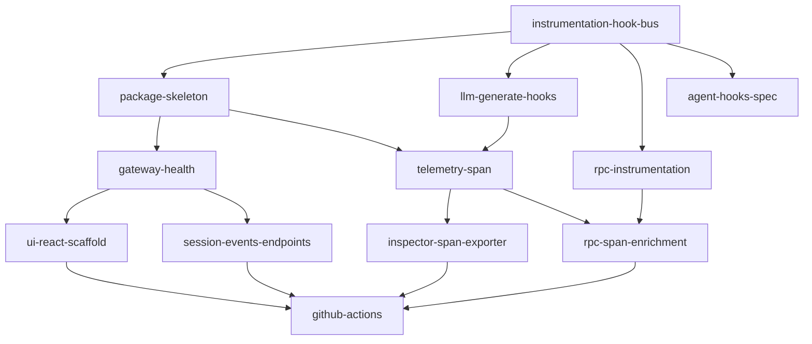

# Milestone 1-bootstrap: Core Foundation

**Status**: In Progress  
**Target**: Minimal viable inspector that can be imported and mounted  
**Dependencies**: None (first milestone)

## Overview

Bootstrap milestone establishes the foundational structure for mcp-agent-inspector with zero external dependencies. After completion, developers can import and mount the inspector, though functionality will be minimal.

## Success Criteria

- Instrumentation hook bus implemented in mcp-agent core
- Inspector module exists and can be imported
- Basic HTTP gateway serves health endpoint
- Frontend scaffold displays "Inspector Online"
- CI/CD pipeline validates code quality
- Zero impact on existing mcp-agent functionality

## Tasks

### bootstrap/feat/instrumentation-hook-bus
**Priority**: Critical  
**Description**: Implement core instrumentation hook system

**Acceptance Criteria**:
- `from mcp_agent.core import instrument` works
- `instrument.register()` and `instrument.unregister()` functions exist
- Hook callbacks fire when `_emit()` is called
- First three emit sites implemented: Agent.call_tool, Workflow.run, AugmentedLLM.generate
- Unit tests demonstrate <70ns overhead with no subscribers

**Implementation Notes**:
```python
# Files to create:
src/mcp_agent/core/instrument.py    # Hook bus implementation
# Files to modify:
src/mcp_agent/agent.py              # Add _emit() calls
src/mcp_agent/workflows/base.py     # Add _emit() calls  
src/mcp_agent/llm/augmented.py      # Add _emit() calls
```

**Reference**: Follow contract in [instrumentation-hooks.md](../../instrumentation-hooks.md)

---

### bootstrap/feat/inspector-package-skeleton
**Priority**: High  
**Description**: Create inspector package structure with mount function

**Acceptance Criteria**:
- `from mcp_agent.inspector import mount, __version__` works
- `__version__` returns "0.0.1"
- Mount function exists (stub is acceptable)

**Implementation Notes**:
```python
# Files to create:
src/mcp_agent/inspector/__init__.py    # Re-exports
src/mcp_agent/inspector/version.py     # __version__ constant
src/mcp_agent/inspector/gateway.py     # mount() stub
```

---

### bootstrap/feat/gateway-health-endpoint
**Priority**: High  
**Description**: Implement HTTP gateway with health endpoint

**Acceptance Criteria**:
- `mount(app)` attaches routes to existing FastAPI app
- `mount()` without app spawns internal Uvicorn server
- GET `/_inspector/health` returns `{"name": "mcp-agent-inspector", "version": "0.0.1"}`
- Server binds to 127.0.0.1:7800 (configurable via INSPECTOR_PORT)

**Implementation Notes**:
- Use Starlette/FastAPI router with prefix `/_inspector`
- Background thread for standalone mode
- Clean shutdown via atexit handler
- Update docs/inspector/openapi.yaml if this task changes the HTTP contract

---

### bootstrap/feat/llm-generate-hooks
**Priority**: Medium  
**Description**: Add instrumentation hooks to AugmentedLLM implementations

**Acceptance Criteria**:
- `before_llm_generate` and `after_llm_generate` hooks added to all LLM providers
- Hook emits before/after each generate() call with llm instance, prompt, and response
- Works for all providers: Anthropic, OpenAI, Azure, Bedrock, Google, Ollama
- Unit tests verify hooks fire for each provider
- No impact on LLM functionality or error handling

**Implementation Notes**:
```python
# Add to each provider's generate method:
# Beginning of generate():
await instrument._emit("before_llm_generate", llm=self, prompt=message)

# End of generate() (before return):
await instrument._emit("after_llm_generate", llm=self, prompt=message, response=responses)

# Files to modify:
src/mcp_agent/workflows/llm/augmented_llm_anthropic.py
src/mcp_agent/workflows/llm/augmented_llm_openai.py
src/mcp_agent/workflows/llm/augmented_llm_azure.py
src/mcp_agent/workflows/llm/augmented_llm_bedrock.py
src/mcp_agent/workflows/llm/augmented_llm_google.py
src/mcp_agent/workflows/llm/augmented_llm_ollama.py
```

**Testing Strategy**:
- Mock each LLM provider in tests
- Verify hooks fire with correct arguments
- Ensure exceptions in hooks don't break LLM calls
- Test both sync and async generate methods

---

### bootstrap/feat/telemetry-span-attributes
**Priority**: Medium  
**Description**: Add core span enrichment infrastructure
**Dependencies**: instrumentation-hook-bus, llm-generate-hooks

**Note**: This is a critical dependency for 2-observe milestone. Consider completing before moving to 2-observe.

**Acceptance Criteria**:
- Core infrastructure for span attribute enrichment
- SpanMeta class with attribute constants
- Base decorator `@dump_state_to_span()` implementation
- Size limit enforcement (30KB) with truncation
- Basic hook subscribers for agent and workflow spans

**Sub-tasks** (implement incrementally):
1. **telemetry-span-core**: Base infrastructure, SpanMeta class, size limits
2. **telemetry-span-decorator**: `@dump_state_to_span()` decorator implementation
3. **telemetry-span-agent**: Agent-specific attributes (`mcp.agent.*`)
4. **telemetry-span-workflow**: Workflow attributes (`mcp.workflow.*`)
5. **telemetry-span-tool**: Tool call attributes (`mcp.tool.*`)

**Implementation Notes**:
```python
# src/mcp_agent/inspector/span_meta.py
class SpanMeta:
    # Agent attributes
    AGENT_CLASS = "mcp.agent.class"
    AGENT_NAME = "mcp.agent.name"
    
    # Workflow attributes
    WORKFLOW_TYPE = "mcp.workflow.type"
    WORKFLOW_INPUT_JSON = "mcp.workflow.input_json"
    WORKFLOW_OUTPUT_JSON = "mcp.workflow.output_json"
    
    # Tool attributes
    TOOL_NAME = "mcp.tool.name"
    TOOL_INPUT_JSON = "mcp.tool.input_json"
    TOOL_OUTPUT_JSON = "mcp.tool.output_json"
    
    # Size limits
    MAX_ATTRIBUTE_SIZE = 30 * 1024  # 30KB

# src/mcp_agent/inspector/decorators.py
def dump_state_to_span(description=None):
    """Decorator to capture function return value as span attribute"""
    # Implementation here

# src/mcp_agent/inspector/subscribers.py
from mcp_agent.core import instrument

async def before_workflow_run(workflow, context, **_kw):
    span = trace.get_current_span()
    if span:
        span.set_attribute(SpanMeta.AGENT_CLASS, agent.__class__.__name__)

instrument.register("before_agent_call", before_agent_call)
```

---

### bootstrap/feat/ui-react-scaffold
**Priority**: Medium  
**Description**: Create React frontend foundation

**Acceptance Criteria**:
- Vite + React + TypeScript project in `packages/inspector_ui`
- Displays "Inspector Online" message
- Fetches and shows backend version
- Static assets served at `/_inspector/ui`

**Implementation Notes**:
- Use `npm create vite@latest` with react-ts template
- Configure base URL in vite.config.ts
- Include static files in Python package data

---

### bootstrap/feat/rpc-instrumentation
**Priority**: Critical  
**Description**: Implement RPC/transport layer hooks  
**Dependencies**: instrumentation-hook-bus

**Acceptance Criteria**:
- `before_rpc_request`, `after_rpc_response`, `error_rpc_request` hooks implemented
- Hooks capture JSON-RPC method, id, transport type, duration
- Works for all transports: stdio, sse, http, websocket
- Transport health attributes captured (status, reconnect count)
- Unit tests verify hooks fire correctly

**Implementation Notes**:
```python
# Files to modify:
src/mcp_agent/mcp/gen_client.py         # Add hooks around RPC calls
src/mcp_agent/mcp/mcp_connection_manager.py  # Add transport health hooks

# Example implementation:
async def _request(self, method: str, params: dict):
    envelope = {"jsonrpc": "2.0", "method": method, "params": params, "id": self._next_id()}
    await instrument._emit("before_rpc_request", envelope=envelope, transport=self.transport_type)
    start_time = time.time()
    try:
        response = await self._send(envelope)
        duration_ms = (time.time() - start_time) * 1000
        await instrument._emit("after_rpc_response", envelope=response, transport=self.transport_type, duration_ms=duration_ms)
        return response
    except Exception as e:
        await instrument._emit("error_rpc_request", envelope=envelope, transport=self.transport_type, exc=e)
        raise
```

---

### bootstrap/feat/agent-hooks-spec
**Priority**: High  
**Description**: Add agent hooks to formal specification  
**Dependencies**: instrumentation-hook-bus

**Acceptance Criteria**:
- `before_agent_call`, `after_agent_call`, `error_agent_call` added to instrumentation-hooks.md
- Hook catalogue table updated with signatures
- Version bumped to v1.1 with changelog entry
- Existing implementation aligned with spec

**Implementation Notes**:
- Add to section 5 (Core hook catalogue)
- Signature: before_agent_call(agent, **kwargs)
- Update version history section
- No code changes needed (already implemented)

---

### bootstrap/feat/session-events-endpoints
**Priority**: High  
**Description**: Implement basic session listing and SSE endpoints  
**Dependencies**: gateway-health-endpoint

**Acceptance Criteria**:
- GET `/_inspector/sessions` returns list of trace files from ~/.mcp_traces/
- GET `/_inspector/events` returns SSE stream
- Sessions include: id, started_at, status (from file metadata)
- Events stream connected/disconnected status
- OpenAPI spec updated with new endpoints

**Implementation Notes**:
```python
# New files:
src/mcp_agent/inspector/sessions.py  # Session listing logic
src/mcp_agent/inspector/events.py    # SSE streaming

# Gateway updates:
@_router.get("/sessions")
async def list_sessions():
    # Scan ~/.mcp_traces/ for *.jsonl.gz files
    # Extract metadata from first/last span
    # Return SessionMeta objects

@_router.get("/events") 
async def event_stream():
    # Return EventSourceResponse
    # Subscribe to AsyncEventBus
    # Stream events as SSE
```

---

### bootstrap/feat/inspector-span-exporter
**Priority**: High  
**Description**: Extend existing FileSpanExporter for Inspector needs  
**Dependencies**: telemetry-span-attributes

**Acceptance Criteria**:
- Extends existing FileSpanExporter to add gzip compression
- Default path to ~/.mcp_traces/{session_id}.jsonl.gz
- Integrates with Inspector's context.get() for session_id
- Supports file rotation at 100MB
- Handles disk space errors gracefully
- Preserves backward compatibility with existing FileSpanExporter

**Implementation Notes**:
```python
# Option A: Extend existing FileSpanExporter
# Modify src/mcp_agent/tracing/file_span_exporter.py:
- Add gzip support when filename ends with .gz
- Add inspector_mode flag or detect based on path pattern
- Integrate with inspector.context.get() when session_id is used

# Option B: Subclass in inspector module
# src/mcp_agent/inspector/exporters.py
from mcp_agent.tracing.file_span_exporter import FileSpanExporter
class InspectorFileSpanExporter(FileSpanExporter):
    def __init__(self):
        path_settings = TracePathSettings(
            path_pattern="~/.mcp_traces/{unique_id}.jsonl.gz",
            unique_id="session_id"
        )
        super().__init__(path_settings=path_settings)
    
    # Override export() to add gzip support
```

---

### bootstrap/feat/rpc-span-enrichment
**Priority**: Medium  
**Description**: Add RPC attribute constants and subscribers  
**Dependencies**: rpc-instrumentation, telemetry-span-attributes

**Acceptance Criteria**:
- SpanMeta updated with RPC attribute constants
- Subscribers implemented for RPC hooks
- Size limits enforced for request/response JSON
- Transport health attributes captured
- Tests verify enrichment works

**Implementation Notes**:
```python
# Update span_meta.py:
JSONRPC_VERSION = "mcp.jsonrpc.version"
RPC_METHOD = "mcp.rpc.method"
RPC_ID = "mcp.rpc.id"
RPC_TRANSPORT = "mcp.rpc.transport"
RPC_DURATION_MS = "mcp.rpc.duration_ms"
TRANSPORT_STATUS = "mcp.transport.status"

# Add to subscribers.py:
async def before_rpc_request(envelope, transport, **_kw):
    span = trace.get_current_span()
    if span and span.is_recording():
        span.set_attribute(SpanMeta.RPC_METHOD, envelope.get("method"))
        # etc...
```

---

### bootstrap/ci/github-actions-setup
**Priority**: Low  
**Description**: Establish CI/CD pipeline

**Acceptance Criteria**:
- Python tests run (pytest)
- Type checking passes (mypy)
- Frontend linting passes (eslint, prettier)
- E2E test verifies health endpoint
- Contract tests validate OpenAPI spec (schemathesis)
- All tests complete in <90s

**Implementation Notes**:
- Add to existing workflows or create new
- Matrix testing for Python 3.9-3.11
- Cache dependencies for speed
- Create initial `docs/inspector/openapi.yaml` with health endpoint definition

## Task Dependencies



## Definition of Done

- [ ] All tasks completed and tested
- [ ] Documentation updated
- [ ] No regressions in existing mcp-agent tests
- [ ] Milestone retrospective completed
- [ ] Next milestone tasks refined