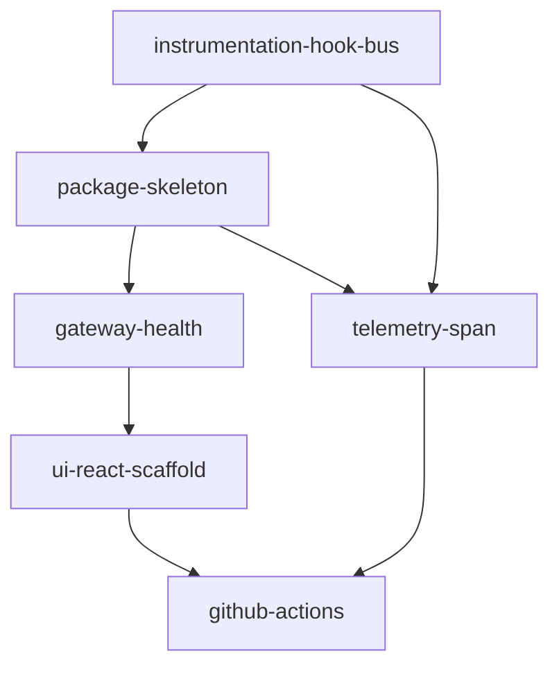

# Milestone 1-bootstrap: Core Foundation

**Status**: In Progress  
**Target**: Minimal viable inspector that can be imported and mounted  
**Dependencies**: None (first milestone)

## Overview

Bootstrap milestone establishes the foundational structure for mcp-agent-inspector with zero external dependencies. After completion, developers can import and mount the inspector, though functionality will be minimal.

## Success Criteria

- Instrumentation hook bus implemented in mcp-agent core
- Inspector module exists and can be imported
- Basic HTTP gateway serves health endpoint
- Frontend scaffold displays "Inspector Online"
- CI/CD pipeline validates code quality
- Zero impact on existing mcp-agent functionality

## Tasks

### bootstrap/feat/instrumentation-hook-bus
**Priority**: Critical  
**Description**: Implement core instrumentation hook system

**Acceptance Criteria**:
- `from mcp_agent.core import instrument` works
- `instrument.register()` and `instrument.unregister()` functions exist
- Hook callbacks fire when `_emit()` is called
- First three emit sites implemented: Agent.call_tool, Workflow.run, AugmentedLLM.generate
- Unit tests demonstrate <70ns overhead with no subscribers

**Implementation Notes**:
```python
# Files to create:
src/mcp_agent/core/instrument.py    # Hook bus implementation
# Files to modify:
src/mcp_agent/agent.py              # Add _emit() calls
src/mcp_agent/workflows/base.py     # Add _emit() calls  
src/mcp_agent/llm/augmented.py      # Add _emit() calls
```

**Reference**: Follow contract in [instrumentation-hooks.md](../../instrumentation-hooks.md)

---

### bootstrap/feat/inspector-package-skeleton
**Priority**: High  
**Description**: Create inspector package structure with mount function

**Acceptance Criteria**:
- `from mcp_agent.inspector import mount, __version__` works
- `__version__` returns "0.0.1"
- Mount function exists (stub is acceptable)

**Implementation Notes**:
```python
# Files to create:
src/mcp_agent/inspector/__init__.py    # Re-exports
src/mcp_agent/inspector/version.py     # __version__ constant
src/mcp_agent/inspector/gateway.py     # mount() stub
```

---

### bootstrap/feat/gateway-health-endpoint
**Priority**: High  
**Description**: Implement HTTP gateway with health endpoint

**Acceptance Criteria**:
- `mount(app)` attaches routes to existing FastAPI app
- `mount()` without app spawns internal Uvicorn server
- GET `/_inspector/health` returns `{"name": "mcp-agent-inspector", "version": "0.0.1"}`
- Server binds to 127.0.0.1:7800 (configurable via INSPECTOR_PORT)

**Implementation Notes**:
- Use Starlette/FastAPI router with prefix `/_inspector`
- Background thread for standalone mode
- Clean shutdown via atexit handler
- Update docs/inspector/openapi.yaml if this task changes the HTTP contract

---

### bootstrap/feat/telemetry-span-attributes
**Priority**: Medium  
**Description**: Add first span enrichment using hook system

**Acceptance Criteria**:
- SpanMeta class defines attribute constants
- Hook subscriber adds `mcp.agent.class` attribute to spans
- Attribute visible in trace output
- No monkey-patching used

**Implementation Notes**:
```python
# src/mcp_agent/inspector/span_meta.py
class SpanMeta:
    AGENT_CLASS = "mcp.agent.class"
    # Future attributes defined here

# src/mcp_agent/inspector/subscribers.py
from mcp_agent.core import instrument

async def before_agent_call(agent, **_kw):
    span = trace.get_current_span()
    if span:
        span.set_attribute(SpanMeta.AGENT_CLASS, agent.__class__.__name__)

instrument.register("before_agent_call", before_agent_call)
```

---

### bootstrap/feat/ui-react-scaffold
**Priority**: Medium  
**Description**: Create React frontend foundation

**Acceptance Criteria**:
- Vite + React + TypeScript project in `packages/inspector_ui`
- Displays "Inspector Online" message
- Fetches and shows backend version
- Static assets served at `/_inspector/ui`

**Implementation Notes**:
- Use `npm create vite@latest` with react-ts template
- Configure base URL in vite.config.ts
- Include static files in Python package data

---

### bootstrap/ci/github-actions-setup
**Priority**: Low  
**Description**: Establish CI/CD pipeline

**Acceptance Criteria**:
- Python tests run (pytest)
- Type checking passes (mypy)
- Frontend linting passes (eslint, prettier)
- E2E test verifies health endpoint
- Contract tests validate OpenAPI spec (schemathesis)
- All tests complete in <90s

**Implementation Notes**:
- Add to existing workflows or create new
- Matrix testing for Python 3.9-3.11
- Cache dependencies for speed
- Create initial `docs/inspector/openapi.yaml` with health endpoint definition

## Task Dependencies



## Definition of Done

- [ ] All tasks completed and tested
- [ ] Documentation updated
- [ ] No regressions in existing mcp-agent tests
- [ ] Milestone retrospective completed
- [ ] Next milestone tasks refined