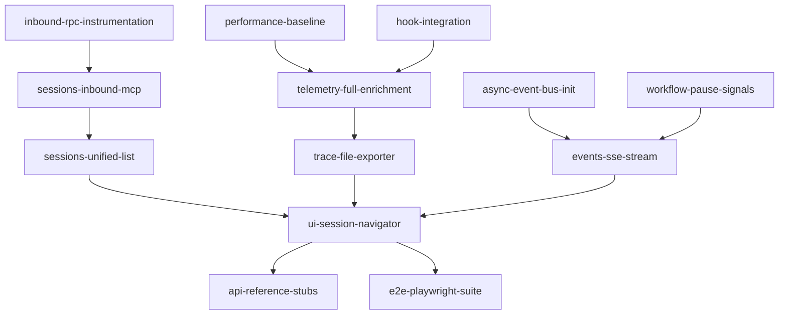

# Milestone 2-observe: Dogfood MVP

**Status**: Not Started  
**Target**: Basic observability for real mcp-agent workflows  
**Dependencies**: 1-bootstrap completed

## Overview

The observe milestone delivers immediate debugging value by making mcp-agent workflows visible. Developers can see sessions, browse traces, inspect state, and understand why workflows pause.

## Success Criteria

- All workflow types (asyncio/Temporal) appear in unified session list
- Traces stream to browser with full span attributes
- State and LLM messages visible in formatted JSON
- Paused workflows show clear status indicators
- Zero external dependencies maintained

## Tasks

### observe/fix/async-event-bus-init
**Priority**: Critical  
**Description**: Fix AsyncEventBus initialization for proper event streaming

**Acceptance Criteria**:
- AsyncEventBus properly initializes `_queue` attribute in all contexts
- No more `AttributeError: 'AsyncEventBus' object has no attribute '_queue'` in tests
- Verified working in both test and production environments
- Compatible with future Temporal executor requirements

**Implementation Notes**:
- Root cause is in `mcp_agent.logging.transport`
- May require ensuring proper context initialization
- Critical for SSE streaming to work correctly
- Add integration test to prevent regression

---

### observe/test/performance-baseline
**Priority**: High  
**Description**: Establish realistic performance benchmarks

**Acceptance Criteria**:
- Measure actual hook overhead (target: <2µs per emit)
- Measure span processing time (target: <5µs per span)
- Measure trace file write performance
- Create performance regression test suite
- Document findings in architecture.md

**Implementation Notes**:
```python
# Use pytest-benchmark
def test_hook_overhead(benchmark):
    result = benchmark(instrument._emit, "test_hook")
    assert result < 2000  # nanoseconds
```

---

### observe/docs/hook-integration
**Priority**: Medium  
**Description**: Document hook-to-telemetry mapping

**Acceptance Criteria**:
- Complete "Hook" column in all telemetry-spec.md tables
- Document which hooks are responsible for each attribute
- Add examples of hook subscriber implementations
- Cross-reference with instrumentation-hooks.md

**Implementation Notes**:
- Some hooks may not exist yet (mark as "future")
- Include both implemented and planned hooks
- Make machine-parseable for automated validation

---

### observe/feat/sessions-unified-list
**Priority**: High  
**Description**: Unified endpoint for all active sessions

**Acceptance Criteria**:
- GET `/_inspector/sessions` returns combined list
- Queries InMemoryWorkflowRegistry for asyncio workflows
- Queries Temporal service for temporal workflows (if available)
- Unified format: `{id, status, started_at, engine, title}`
- Graceful degradation if Temporal unavailable

**Implementation Notes**:
- Handle Temporal connection errors without failing endpoint
- Cache session metadata for performance
- Sort by start time descending
- Update docs/inspector/openapi.yaml if this task changes the HTTP contract

---

### observe/feat/trace-file-exporter
**Priority**: High  
**Description**: Stream traces from gzipped JSONL files

**Acceptance Criteria**:
- FileSpanExporter writes to `~/.mcp_traces/{session_id}.jsonl.gz`
- GET `/_inspector/trace/{session_id}` streams file content
- Supports HTTP Range headers for progressive loading
- Content-Encoding: gzip header set correctly

**Implementation Notes**:
```python
# Use aiofiles for async file operations
async with aiofiles.open(trace_path, 'rb') as f:
    async for chunk in f:
        yield chunk
```
- Update docs/inspector/openapi.yaml if this task changes the HTTP contract

---

### observe/feat/events-sse-stream
**Priority**: High  
**Description**: Real-time event streaming via Server-Sent Events

**Acceptance Criteria**:
- GET `/_inspector/events` returns SSE stream
- Connects to existing AsyncEventBus
- Events include: SessionStarted, Heartbeat, WaitingOnSignal, SessionFinished
- Auto-reconnect with event ID tracking

**Implementation Notes**:
- Use monotonic counter for SSE event IDs
- Set retry to 2000ms
- Ring buffer for last 1000 events
- Update docs/inspector/openapi.yaml if this task changes the HTTP contract

---

### observe/feat/telemetry-full-enrichment
**Priority**: High  
**Description**: Capture comprehensive span attributes

**Acceptance Criteria**:
- LLM spans include `mcp.llm.prompt_json` and `mcp.llm.response_json`
- Tool spans include `mcp.tool.input_json` and `mcp.tool.output_json`
- Resource spans include `mcp.resource.uri` and metadata
- Workflow spans include state via `@dump_state_to_span`

**Implementation Notes**:
- Hook into AugmentedLLM.generate for message capture
- Add decorator to workflow run methods
- Respect 30KB size limit per attribute

---

### observe/feat/sessions-inbound-mcp
**Priority**: Medium  
**Description**: Track inbound MCP requests as sessions

**Acceptance Criteria**:
- Middleware on app_server.py creates "inbound" sessions
- Uses MCP request_id as session_id
- Shows with `engine="mcp-inbound"` in session list
- Full trace of internal workflow execution

**Implementation Notes**:
```python
# Extract from request headers
request_id = request.headers.get("X-MCP-Request-Id")
if request_id:
    context.set(request_id)
```

---

### observe/feat/inbound-rpc-instrumentation
**Priority**: Medium  
**Description**: Add RPC instrumentation for inbound MCP requests  
**Dependencies**: bootstrap/feat/rpc-instrumentation (for consistency)

**Acceptance Criteria**:
- FastAPI/Starlette middleware captures raw JSON-RPC envelopes
- Emits before_rpc_request hook with inbound envelope and transport="http"
- Emits after_rpc_response hook with response envelope and duration_ms
- Emits error_rpc_request on failures
- Works alongside sessions-inbound-mcp session creation

**Implementation Notes**:
```python
# In app_server.py middleware:
class InboundRPCInstrumentationMiddleware:
    async def dispatch(self, request, call_next):
        # Read raw body (careful with streaming)
        body = await request.body()
        envelope = json.loads(body)
        
        # Emit before hook
        await instrument._emit("before_rpc_request", 
                             envelope=envelope, 
                             transport="http")
        
        start = time.time()
        try:
            # Re-attach body for downstream processing
            request._body = body
            response = await call_next(request)
            
            # Capture response (if possible)
            duration_ms = (time.time() - start) * 1000
            await instrument._emit("after_rpc_response",
                                 envelope=response_envelope,
                                 transport="http", 
                                 duration_ms=duration_ms)
        except Exception as e:
            await instrument._emit("error_rpc_request",
                                 envelope=envelope,
                                 transport="http",
                                 exc=e)
            raise
```

**Note**: This complements the outbound RPC instrumentation from bootstrap by capturing the server-side of MCP interactions, enabling full end-to-end tracing.

---

### observe/feat/workflow-pause-signals
**Priority**: Medium  
**Description**: Surface paused workflow states

**Acceptance Criteria**:
- WaitingOnSignal events emitted for elicitation/human_input
- Session status shows "PAUSED" in UI
- Event includes signal name, prompt, and schema
- Clear visual indicator in session list

**Implementation Notes**:
- Hook into elicitation/handler.py
- Hook into human_input/handler.py
- Emit events via AsyncEventBus

---

### observe/feat/ui-session-navigator
**Priority**: High  
**Description**: Core UI for session browsing

**Acceptance Criteria**:
- Session list with live status updates
- Virtualized span tree navigator
- Three-tab inspector panel:
  - Attributes: Key-value pairs
  - State/Result: JSON viewer for *_json attributes
  - Context: LLM message viewer
- SSE connection status indicator

**Implementation Notes**:
- Use @tanstack/react-virtual for large lists
- Web Worker for trace parsing
- Debounce updates to maintain 60fps

---

### observe/docs/api-reference-stubs
**Priority**: Low  
**Description**: Initial API documentation

**Acceptance Criteria**:
- README with installation instructions
- API endpoint reference
- Screenshot of working UI
- Note in telemetry-spec.md about implemented attributes

---

### observe/test/e2e-playwright-suite
**Priority**: Medium  
**Description**: End-to-end test coverage

**Acceptance Criteria**:
- Spins up demo agent with inspector
- Verifies session appears in list
- Clicks through to span details
- Validates all three inspector tabs
- Tests SSE reconnection

**Implementation Notes**:
```javascript
test('inspector shows workflow state', async ({ page }) => {
  // Start orchestrator example
  // Navigate to inspector
  // Verify PlanResult visible
});
```

## Task Dependencies



## Contingency Planning

Based on 1-bootstrap implementation experience, we allocate a 20% buffer for:
- Bug fixes discovered during implementation
- Performance optimizations needed to meet targets
- Additional test coverage for edge cases
- Documentation updates based on actual behavior

Common issues to watch for:
- Variable reassignment bugs (like the LLM prompt issue)
- Type checking conflicts with existing code
- AsyncEventBus initialization in different contexts
- Import path confusion between similar classes

## Definition of Done

- [ ] All tasks completed and tested
- [ ] Dogfood checklist verified
- [ ] No performance regressions (<2µs hook overhead confirmed)
- [ ] Documentation updated
- [ ] AsyncEventBus issues resolved
- [ ] Ready for understand milestone