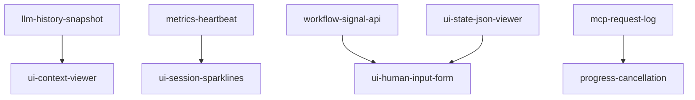

# Milestone 3-understand: Enhanced Debugging

**Status**: Not Started  
**Target**: Polish UI and enable workflow unblocking  
**Dependencies**: 2-observe completed

## Overview

The understand milestone transforms raw debugging data into actionable insights. It adds polished UI components, live metrics, and the ability to unblock paused workflows directly from the Inspector.

## Success Criteria

- JSON state displayed in collapsible tree format
- Full LLM conversation history visible
- Human input forms auto-generated from schemas
- Live token usage and cost tracking
- Progress bars for long operations

## Tasks

### understand/feat/llm-history-snapshot
**Priority**: High  
**Description**: Capture LLM conversation context

**Acceptance Criteria**:
- AugmentedLLM.generate adds history snapshot attribute
- Last 20 messages included (or 10KB limit)
- Stored as `mcp.llm.history_snapshot`
- JSON serialized without whitespace

**Implementation Notes**:
```python
# In AugmentedLLM.generate
history = self.messages[-20:]  # Last 20 messages
snapshot = json.dumps(history, separators=(',', ':'))
if len(snapshot) > 10240:  # 10KB limit
    # Truncate older messages
```

---

### understand/feat/metrics-heartbeat
**Priority**: High  
**Description**: Live metrics via periodic events

**Acceptance Criteria**:
- Background task emits Heartbeat events every 10s
- Tracks token usage, cost, LLM calls per session
- Delta values since last heartbeat
- Frontend accumulates for sparklines

**Implementation Notes**:
- Store last counters per session
- Use asyncio.create_task in mount()
- Include in SSE event stream

---

### understand/feat/workflow-signal-api
**Priority**: High  
**Description**: API to unblock paused workflows

**Acceptance Criteria**:
- POST `/_inspector/signal/{session_id}` endpoint
- Accepts `{signal: string, payload: any}`
- Resolves workflow from registry
- Calls appropriate signal handler

**Implementation Notes**:
```python
@router.post("/signal/{session_id}")
async def send_signal(session_id: str, body: SignalPayload):
    workflow = registry.get(session_id)
    if not workflow:
        raise HTTPException(404)
    await workflow.signal(body.signal, body.payload)
```
- Update docs/inspector/openapi.yaml if this task changes the HTTP contract

---

### understand/feat/ui-state-json-viewer
**Priority**: High  
**Description**: Interactive JSON tree component

**Acceptance Criteria**:
- Replace raw JSON with react-json-view
- Collapsible nodes with +/- indicators
- Copy path to clipboard functionality
- Syntax highlighting

**Implementation Notes**:
- Configure for read-only initially
- Prepare for future edit capability
- Handle large JSON gracefully

---

### understand/feat/ui-context-viewer
**Priority**: High  
**Description**: Multi-part message visualization

**Acceptance Criteria**:
- Chat transcript style rendering
- Support text, image, resource, tool_use parts
- Token count pill "3.2k/8k"
- Tab icon 📜

**Implementation Notes**:
- Parse message content array
- Render images inline (base64)
- Show resource URIs as links
- Tool calls in code blocks

---

### understand/feat/ui-human-input-form
**Priority**: High  
**Description**: Dynamic forms from JSON Schema

**Acceptance Criteria**:
- Auto-generate form from signal schema
- Support common types (string, number, boolean, object)
- Validation before submission
- Loading state during signal call

**Implementation Notes**:
- Use react-hook-form + zod
- Show schema description as help text
- Handle nested objects

---

### understand/feat/ui-session-sparklines
**Priority**: Medium  
**Description**: Resource usage visualization

**Acceptance Criteria**:
- Inline SVG sparklines in session table
- Show token usage over time
- Tooltip with detailed metrics
- Live updates from heartbeats

**Implementation Notes**:
- Use D3 or lightweight alternative
- Keep last 50 data points
- Smooth animations

---

### understand/feat/mcp-request-log
**Priority**: Medium  
**Description**: Inbound MCP request viewer

**Acceptance Criteria**:
- New tab for inbound sessions
- List of tool calls with timing
- Expandable request/response bodies
- Filter by tool name

**Implementation Notes**:
- Ring buffer in middleware (last 100)
- GET `/_inspector/trace/{sid}/mcp_requests`
- Virtualized list for performance
- Update docs/inspector/openapi.yaml if this task changes the HTTP contract

---

### understand/feat/progress-cancellation
**Priority**: Low  
**Description**: Long operation visibility

**Acceptance Criteria**:
- Capture MCP progress notifications
- Show progress bar in UI
- Cancel button sends cancellation
- ProgressUpdate events via SSE

**Implementation Notes**:
- Store progress_token in span attributes
- POST `/_inspector/cancel/{session_id}`
- Handle partial progress gracefully
- Update docs/inspector/openapi.yaml if this task changes the HTTP contract

## Task Dependencies



## Definition of Done

- [ ] All tasks completed with tests
- [ ] UI components follow design system
- [ ] Performance targets maintained
- [ ] Human input example fully functional
- [ ] Ready for visualize milestone