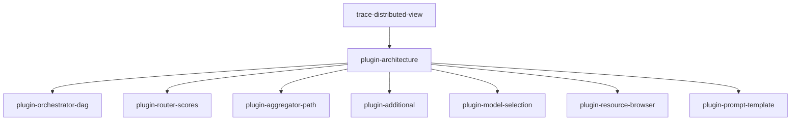

# Milestone 4-visualize: Workflow Visuals

**Status**: Not Started  
**Target**: Rich visualizations for workflow comprehension  
**Dependencies**: 3-understand completed

## Overview

The visualize milestone transforms Inspector from a trace viewer into a workflow intelligence tool. Complex workflows become intuitive through purpose-built visualizations for each workflow type.

## Success Criteria

- Orchestrator plans render as interactive DAGs
- Router decisions show score breakdowns
- Plugin system allows custom visualizers
- Cross-process traces correlated
- Resource and prompt usage visualized

## Tasks

### visualize/feat/plugin-architecture
**Priority**: High  
**Description**: Extensible visualization system

**Acceptance Criteria**:
- VisualizerPlugin interface defined
- Registry with match() predicate system
- Fallback to raw view if no plugin matches
- Plugins can access full span data

**Implementation Notes**:
```typescript
interface VisualizerPlugin {
  matches: (span: Span) => boolean;
  component: React.ComponentType<{span: Span}>;
  meta: { name: string; icon?: string; priority?: number };
}
```

---

### visualize/feat/plugin-orchestrator-dag
**Priority**: High  
**Description**: DAG visualization for orchestrator workflows

**Acceptance Criteria**:
- Parse workflow.plan_json into graph structure
- React Flow renders nodes and edges
- Nodes colored by status (pending/running/completed/failed)
- Click node to navigate to span

**Implementation Notes**:
- Use @reactflow/reactflow
- Auto-layout with dagre
- Animate status changes
- Show step descriptions

---

### visualize/feat/plugin-router-scores
**Priority**: High  
**Description**: Router decision visualization

**Acceptance Criteria**:
- Parse router_decision_json
- Table with route names and scores
- Bar chart visualization
- Winner highlighted
- Show reasoning text

**Implementation Notes**:
- Sort by score descending
- Use consistent color scheme
- Percentage and raw score display
- Expandable reasoning section

---

### visualize/feat/plugin-aggregator-path
**Priority**: Medium  
**Description**: Tool resolution flow visualization

**Acceptance Criteria**:
- Vertical flow diagram
- Show each server tried
- Indicate hit/miss status
- Display latency per hop

**Implementation Notes**:
- Parse agg.resolution_path attribute
- Timeline-style visualization
- Show server names and tool names
- Color code by success/failure

---

### visualize/feat/plugin-additional
**Priority**: Medium  
**Description**: Additional workflow visualizers

**Components**:
- **EvaluatorLoop**: Iteration cards with quality scores
- **ParallelFanOut**: Swimlanes showing concurrent execution
- **SwarmHandOff**: Sequence diagram of agent handoffs

**Implementation Notes**:
- Consistent visual language
- Reuse color schemes
- Performance with many iterations

---

### visualize/feat/plugin-model-selection
**Priority**: Medium  
**Description**: Model preference visualization

**Acceptance Criteria**:
- Parse mcp.model.preferences_json
- Ranked table with model names
- Score bars or heatmap
- Show selection reasoning

**Implementation Notes**:
- Handle various scoring systems
- Highlight selected model
- Show constraints met/unmet

---

### visualize/feat/trace-distributed-view
**Priority**: High  
**Description**: Cross-process trace correlation

**Acceptance Criteria**:
- Stitch spans using mcp.rpc.id
- Timeline view of distributed call
- Show client and server spans
- Latency breakdown visualization

**Implementation Notes**:
- Use trace_id correlation
- Gantt chart style view
- Collapsible process sections
- Network latency indicators

---

### visualize/feat/plugin-resource-browser
**Priority**: Low  
**Description**: Resource access visualization

**Acceptance Criteria**:
- Tree view of accessed resources
- Group by URI prefix
- Show MIME types with icons
- Display access frequency

**Implementation Notes**:
- Parse mcp.resource.uri attributes
- File tree component
- Size and count badges
- Search/filter capability

---

### visualize/feat/plugin-prompt-template
**Priority**: Low  
**Description**: Prompt template visualization

**Acceptance Criteria**:
- Side-by-side template vs rendered
- Highlight substituted parameters
- Show parameter values
- Template syntax highlighting

**Implementation Notes**:
- Parse mcp.prompt.template_id
- Diff-style visualization
- Color code variables
- Copy rendered result

## Task Dependencies



## Definition of Done

- [ ] Plugin system documented and extensible
- [ ] All core workflow types have visualizers
- [ ] Performance maintained with complex graphs
- [ ] Accessibility for all visualizations
- [ ] Ready for interact milestone