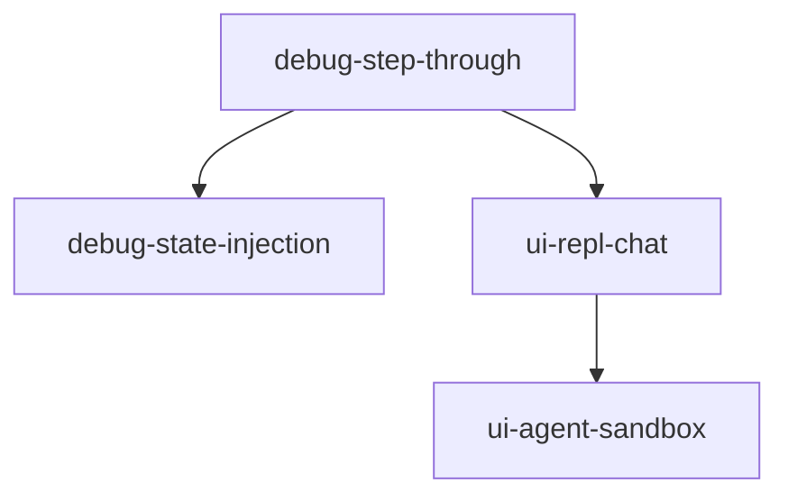

# Milestone 5-interact: Interactive Development

**Status**: Not Started  
**Target**: Interactive debugging and experimentation  
**Dependencies**: 4-visualize completed

## Overview

The interact milestone transforms Inspector from an observability tool into an interactive development environment. Developers can pause workflows, modify state, and experiment with different prompts and configurations.

## Success Criteria

- Workflows can be paused and stepped through
- State can be modified while paused
- Interactive REPL for agent conversations
- Sandbox for prompt experimentation
- All changes tracked and reversible

## Tasks

### interact/feat/debug-step-through
**Priority**: High  
**Description**: Step-through debugging infrastructure

**Acceptance Criteria**:
- BeforeStep event emitted before each orchestrator step
- Workflow pauses awaiting continue signal
- Can skip steps or modify plan
- State snapshot at each pause point

**Implementation Notes**:
```python
# In orchestrator
if self.debug_mode:
    await event_bus.publish(BeforeStep(
        session_id=context.session_id,
        step_id=step.id,
        state=current_state
    ))
    await self.wait_for_signal("continue")
```

---

### interact/feat/ui-repl-chat
**Priority**: High  
**Description**: Interactive chat interface

**Acceptance Criteria**:
- Split view: chat on left, debugger on right
- Streaming token display
- Human input forms render inline
- Full conversation history

**Implementation Notes**:
- Use server-sent events for streaming
- Integrate with existing human_input system
- Show token usage per message
- Export conversation capability

---

### interact/feat/ui-agent-sandbox
**Priority**: High  
**Description**: Agent experimentation sandbox

**Acceptance Criteria**:
- Select from available agents
- Edit instructions and temperature
- Toggle tools on/off
- Compare results side-by-side

**Implementation Notes**:
- Isolated execution environment
- No side effects on real data
- Save/load experiment configurations
- A/B testing view

---

### interact/feat/debug-state-injection
**Priority**: Medium  
**Description**: Runtime state modification

**Acceptance Criteria**:
- Edit JSON state while paused
- Preview diff before applying
- Undo/redo capability
- Validation against schema

**Implementation Notes**:
- Use JSON Schema for validation
- Track modification history
- Confirmation modal for changes
- Rollback on error

---

### interact/feat/security-validations
**Priority**: Critical  
**Description**: Security hardening for interactive features

**Acceptance Criteria**:
- Input validation for all state injections
- Audit logging of all modifications
- Permission checks before state changes
- Sandbox isolation enforcement
- REPL command allowlisting

**Implementation Notes**:
```python
# State injection validation
def validate_state_injection(state_data: dict) -> bool:
    # Check for dangerous keys
    dangerous_patterns = ['__', 'eval', 'exec', 'system']
    if any(pattern in str(state_data) for pattern in dangerous_patterns):
        raise SecurityError("Potentially dangerous state detected")
    
    # Validate against schema
    return validate_against_workflow_schema(state_data)
```

**Testing Strategy**:
- Attempt injection of malicious payloads
- Verify audit logs capture all changes
- Test permission boundaries
- Ensure sandbox cannot affect host system

## Task Dependencies



## Definition of Done

- [ ] Step-through debugging fully functional
- [ ] REPL provides smooth development experience
- [ ] Sandbox enables rapid experimentation
- [ ] All interactive features well-documented
- [ ] Ready for production milestone