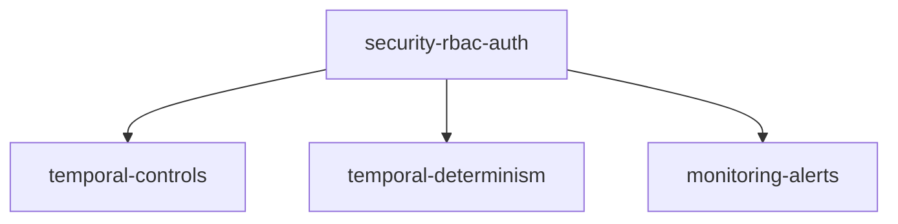

# Milestone 6-production: Production Ready

**Status**: Not Started  
**Target**: Enterprise-grade security and operations  
**Dependencies**: 5-interact completed

## Overview

The production milestone hardens Inspector for enterprise deployment. It adds authentication, role-based access control, monitoring, and full Temporal workflow support.

## Success Criteria

- Multi-tenant authentication system
- Role-based access control (view/modify/admin)
- Production monitoring and alerts
- Full Temporal workflow control
- Security hardened for external exposure

## Tasks

### production/feat/temporal-controls
**Priority**: High  
**Description**: Temporal workflow management UI

**Acceptance Criteria**:
- Pause/resume Temporal workflows
- View workflow info and metadata
- Browse workflow event history
- Handle non-determinism errors

**Implementation Notes**:
```python
# Temporal signal handling
@router.post("/temporal/signal/{workflow_id}")
async def signal_temporal(workflow_id: str, signal: SignalPayload):
    client = await get_temporal_client()
    handle = client.get_workflow_handle(workflow_id)
    await handle.signal(signal.name, signal.payload)
```
- Update docs/inspector/openapi.yaml if this task changes the HTTP contract

---

### production/feat/temporal-determinism
**Priority**: Medium  
**Description**: Non-determinism debugging tools

**Acceptance Criteria**:
- Fetch original and replay histories
- Diff algorithm highlights divergence
- Side-by-side comparison view
- Export diff for analysis

**Implementation Notes**:
- Use Temporal's history API
- Custom diff visualization
- Handle large histories efficiently
- Clear error explanations

---

### production/feat/security-rbac-auth
**Priority**: High  
**Description**: Authentication and authorization

**Acceptance Criteria**:
- Pluggable auth providers (OAuth2, LDAP, SAML)
- Three roles: observer, developer, admin
- Audit logging for all actions
- CSRF protection with proper CORS

**Implementation Notes**:
- Start with session tokens (from understand)
- Add JWT support
- Per-endpoint authorization
- Rate limiting

---

### production/feat/monitoring-alerts
**Priority**: Medium  
**Description**: Production monitoring features

**Acceptance Criteria**:
- Cost alerts when thresholds exceeded
- Error rate monitoring and alerts
- Custom alert configurations
- Integration with external systems

**Implementation Notes**:
- Webhook support for alerts
- Email notifications
- Prometheus metrics export
- Alert history and acknowledgment

## Task Dependencies



## Definition of Done

- [ ] Security audit completed
- [ ] Performance tested at scale
- [ ] Documentation includes deployment guide
- [ ] All enterprise features tested
- [ ] 1.0.0 release candidate ready